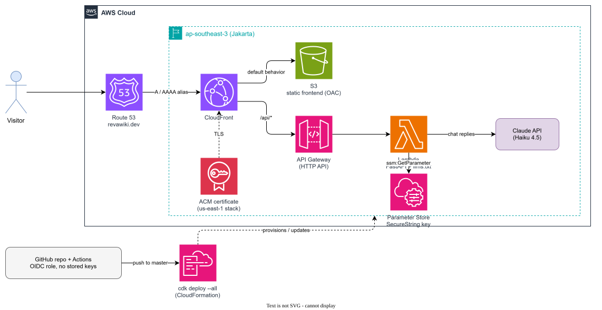

# Personal Portfolio Website

This repository contains my personal portfolio website, [revawiki.dev](https://revawiki.dev) - a static site with an embedded AI version of me that visitors can chat with. The whole thing runs serverless on AWS in the Jakarta region, deployed automatically from this repository via GitHub Actions.

> [!NOTE]
> The chatbot answers only from [`frontend/llms.txt`](frontend/llms.txt) - the same curated summary served to AI crawlers - so the bot and the crawler-facing profile can never drift apart. If it's not written there, the bot says it doesn't know.

## Architecture



| Piece | What it does |
|---|---|
| `frontend/` | Plain HTML/CSS/JS, no build step. Case studies, session recaps, the story page, and the chat widget |
| `backend/app/` | FastAPI chat API: grounding prompt, conversation history, deflection/contact markers, error mapping |
| `infra/` | AWS CDK (Python): S3 + CloudFront, HTTP API + Lambda, IAM, and a us-east-1 certificate stack for the custom domain |
| `.github/workflows/` | Push to `master` → build Lambda bundle → `cdk deploy --all`, authenticated with GitHub OIDC (no stored keys) |

## The chatbot

The widget on every page talks to `/api/chat`, which answers as "the AI version of Reva":

- **Grounded**: every fact comes from `llms.txt`; metrics are quoted exactly as written, never derived or rounded up.
- **Conversion-oriented**: hiring or collaboration intent triggers a direct-contact card immediately; repeated out-of-scope questions trigger it after two deflections.
- **Cost-guarded**: 7 messages per rolling window per tab, then a randomized "catching my breath" cooldown answers locally for 90 seconds before the window reopens.
- **Degrades gracefully**: with no API key configured, a keyword-matched local simulator keeps the widget working end to end.

## Getting Started

These instructions cover running the site locally and deploying your own copy.

### Local development (no AWS needed)

`backend/app/local_dev.py` serves the frontend and the chat API from one process on one origin, so the widget's relative `/api` calls just work.

```bash
cd backend
python -m venv .venv && source .venv/bin/activate   # .venv\Scripts\Activate.ps1 on Windows
pip install -r requirements-dev.txt
export ANTHROPIC_API_KEY=...                        # optional - without it, a dummy reply proves the plumbing
python -m app.local_dev
```

Open http://127.0.0.1:8000/ and chat.

### Deploying to AWS

1. **Bootstrap CDK** (first time per account/region - the site region and `us-east-1` for the CloudFront certificate):
   ```bash
   npx aws-cdk bootstrap aws://ACCOUNT_ID/ap-southeast-3
   npx aws-cdk bootstrap aws://ACCOUNT_ID/us-east-1
   ```

2. **Build the Lambda bundle.** The script pins manylinux wheels so bundles built on Windows/macOS still load on Lambda:
   ```bash
   bash backend/build.sh
   ```

3. **Create the API key parameter** (CloudFormation cannot create SecureStrings, so this is out-of-band and free on the standard tier):
   ```bash
   aws ssm put-parameter --name /wiki-personal-site/chat-api-key \
     --type SecureString --value "YOUR_ANTHROPIC_KEY" --region ap-southeast-3
   ```

4. **Deploy:**
   ```bash
   cd infra
   pip install -r requirements.txt
   npx aws-cdk deploy --all -c domainName=yourdomain.dev   # omit -c for the CloudFront URL only
   ```

After the first manual deploy, every push to `master` redeploys automatically through the GitHub Actions workflow (OIDC role, no long-lived AWS credentials anywhere).

## Cost

At portfolio traffic levels: S3 + CloudFront + HTTP API + Lambda sit within or near the AWS free tier, the SSM parameter is free, and chat replies on Claude Haiku cost fractions of a cent per conversation. Rough steady state: **$0-2/month** plus the domain's yearly registration.

## Acknowledgments

- Chat widget UX (greeting-first thread, quick-question chips, direct-contact card) inspired by [santifer/cv-santiago](https://github.com/santifer/cv-santiago).
